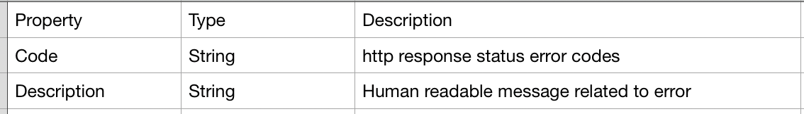

#Response code and error code mapping Approach
### The Value of Error Codes:
Defining error Codes in the response of an API is the fundamental way in which a system can communicate failure to a consumer of the api.
Consider an instance when the system return a response with “401 Unauthorized – Please Pass Token.” Consumer can easily understand and rectify the issue by passing valid token.

### Why are we consolidating error and response codes:
- Consumer of the application can better understand the response and error codes and can handle the response in better way. 
- with proper error and response codes, system can self descriptive and more predictable to the consumers.  
- By consolidating error and response codes, we can add additional grpc codes , modify existing codes very easily in future. 

### Recommendations and Best practices for creating  error codes :
- Always follow standard http response status codes.
- Provide the right number of errors.
  - Based on the business requirements and workflow, return appropriate (either consolidate errors or immediate errors) errors. 
- Error response must have a code and description. 
   - The code serves as a specific indicator of the error.
   - Example of the ‘error’ object with multiple properties included:
     
     
### Best way to Handle response codes and error codes :
 - Separate general and domain errors.
   - General errors
      include the incorrect HTTP verb, unauthorised access etc. It’s typically good to stop the request processing quickly when these errors occur  and send the response back to the consumer. General errors are typically not domain-specific. 
   - Domain errors
      are more specific to the business requirements, for example DeliveryUnavailableException, OrderAlreadyExistsException etc. There might be additional things you’d want to do when these types of errors are encountered.

### Ways to create  response code and error codes mapping: 
- By using enum class (described in next section)
- By using json file 
  for example
  ```
  {
    "errors": [
      {
        "code": "404",
        "description": "account details are incorrect"
      }
    ]
  }
  ```


### Response code and Error code mapping in payment service:
- Created enum class for internal error codes which contain two fields, code and description.
  - Code is a HTTP Status code.
  - Description contain the error message.
  ```
  public enum InternalErrorCodes {
      ACCOUNT_NOT_FOUND("404", "account details are incorrect");
      
      private final String code;
      private final String description;
  
      InternalErrorCodes(String code, String description) {
          this.code = code;
          this.description = description;
      }
  }
  ```
  - We have used this InternalErrorCodes as:
  ```
   InternalErrorCodes.AccountNotFound.toString()
  ```
  
     
-  
